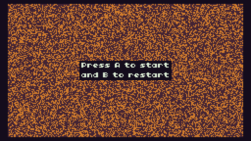

# Game Of Life
> An implementation of Conway's game of life for the TIC-80 fantasy console, created using [TS](https://github.com/scambier/tic80-typescript).



## Build
- Install [TS](https://github.com/scambier/tic80-typescript).
- Modify the configuration file "tsc80-config.json" with the corresponding information and variables.
- Run the command:
```bash
tsc80 run
```
- Enjoy

## Play binary
### Wasam
- Unzip the "export/game-of-life.wasam.zip".
- Serve the files through a web server.
- Use your favorite browser to enjoy.

### Native
- Install [TIC-80](https://tic80.com/).
- Load the cartridge "export/game-of-life.tic" the TIC-80.
- Enjoy.

### Browser
- Go to ["https://tic80.com/play?cart=1795"](https://tic80.com/play?cart=1795).
- Enjoy.
